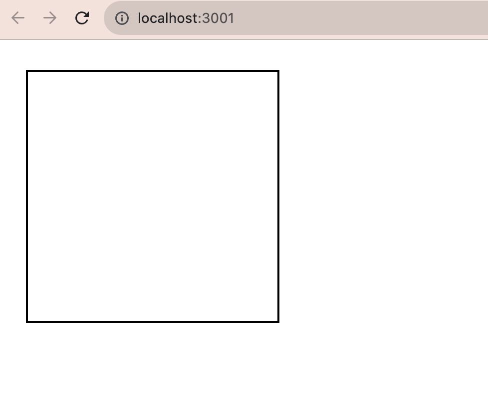
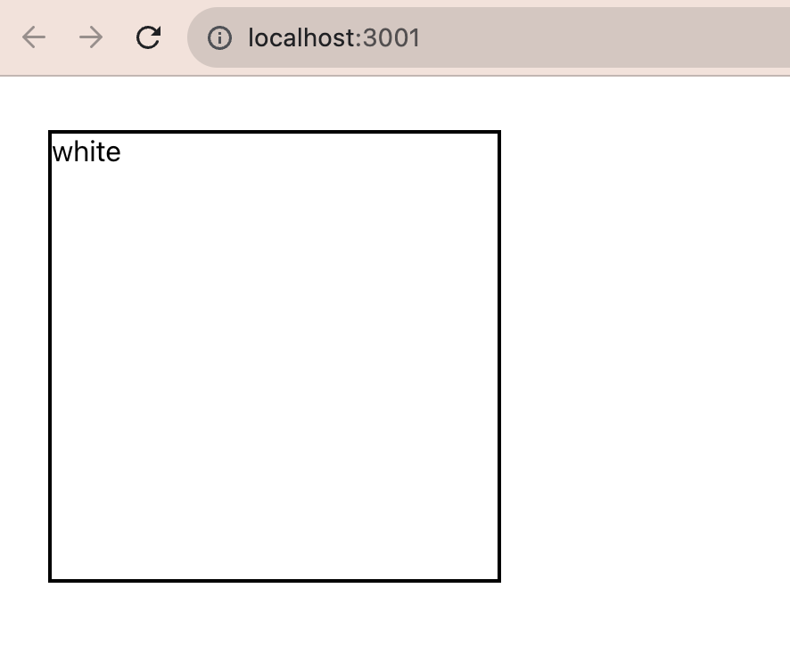

As a developer, you are tasked with creating a color box application. The application will allow the user to click a box and see a different color with every click.

# 📚 User Stories
- ✅ As a user, I can see a square box on the screen with a black border and a white background

  + The first thing we want to do is create a box, we can accomplish this by first creating a functional component. We'll call this compoent Box.js We can then create our box with some simple CSS. A box is simply width and height. However, to implement CSS we need an element to implement it on to. So, we can do this adding a set on div tags and leaving it empty, this way we have an element to work with.

  ```javascript 
  return (
  <>
    <div className="box">

    </div>
  </>
  ```
  + In our CSS file we will create our box by establishing a height and width and then adding a black border 

```css
.box{border: 2px solid black;
width: 250px;
height: 250px;
margin: 30px;
}
```

  + Looking at our browser she should have a box 


---

- ✅ As a user, I can see the default color name "white" inside the box

  + Here, I need a string to appear in the box ("white") we are making this the default color of the box so we can store this in a variable. We can store this value in state. 

  ```javascript
  const Box = () => {
 
  const [color, setColor] = useState("white")

  return (
    <>
      
      <div className="box">

      </div>
   
    </>
  )}
  ```
  + Now that we have established our state variable and inital value (our default color) we can call it inside our box. 

  ```javascript
  return (
      <>
        <div className="box">
          {color}
        </div>
      </>
    )
  ``` 
  + Now, our browser should look like this. 
  
---
- ✅ As a user, every time I click on the box the name of a different color appear. Possible color names: red, orange, yellow, green, blue, purple, pink
  + Here, we want our box to perform an action so its gonna need some behavior. To create behavior we need to create a function. 
  + In plain English: we want to see the string of a new color every time we click. So we are going to need a collection of color strings to choose from. We know that we can store collections of data in a arrays so we will first create an array of colors.

  ```javascript
  const colors = ["red", "yellow",  "rebeccapurple", "green", "black", "mediumvioletred", "deeppink"]
  ```

  + Now that we have our color array we can start building our function. We know that we want a random color with each click so we can do this `Math.random()` which will give us a number between 0 and 1 by the length of our array, then we will round down to the nearest whole number. 

  + We want this function to update the string within the box. We know this string is our current state value, so we essentially need to update state with each click. To do that we will you the setter fuction provided to us by useState. 

  ```javascript

  const colorChange = () => {
    //this will give us the random index
    let randomIndex = Math.floor(Math.random()* colors.length)
    // here, we are updating state to the value of the random index 
    setColor(colors[randomIndex])
  }
  ``` 
  + Now we need our box to reform this action so now we need to add an onClick attribute to our div to trigger the function when we click the box

  ```javascript
   return (
    <>
      <div className="box" onClick={colorChange}>
        {color}
      </div>
    </>
  )
  ```

- ✅ As a user, every time I click the box instead of the color name, I see the background color in the box change to represent the color.
  + We can change the background color with some simple inline styling, but instead of hardcoding our background color we can use our state variable 

  ```javascript
  return (
    <>
      <div className="box" onClick={colorChange} style={{backgroundColor: color}}>
        
      </div>
   
    </>
  )
  ```

  + And there we have it! A color changing box!
